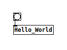

# Running the template in Python
Once the processor is built, we can for instance run it in Python: 

Let's try to run our processor through the Python bindings:

```bash
$ cd build/python

# Check that our processor was built correctly
$ ls
pymy_processor.so

# Run it
$ python
>>> import pymy_processor
>>> proc = pymy_processor.Hello_World()
>>> proc.process()
Henlo
```

# Running the template in PureData
Similarly, one can run the template in PureData: 
```bash
$ cd build/pd

# Check that our processor was built correctly
$ ls
my_processor.l_ia64

# Run it
$ pd -lib my_processor
```

Make the following patch:



When sending a bang, the terminal in which PureData was launched should also print "Henlo".
We'll see in a later chapter how to print on Pd's own console instead.

# Running in DAWs
We could, but so far our object is not really an object that makes sense in a DAW: it does not process audio in any way. We'll see in further chapters how to make audio objects.
